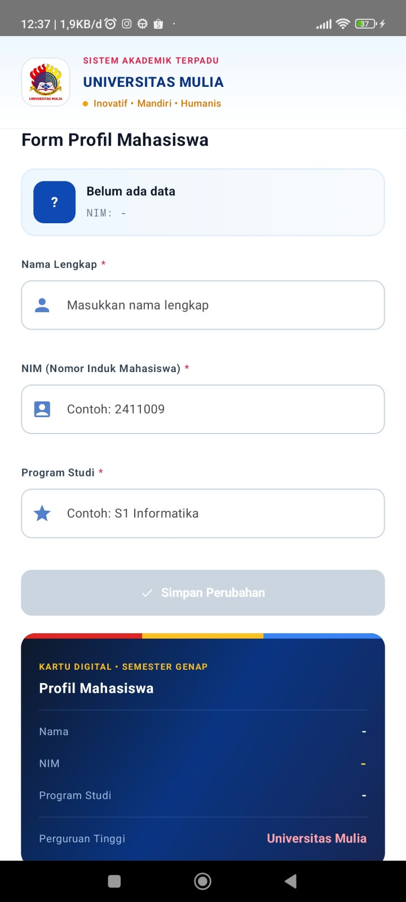
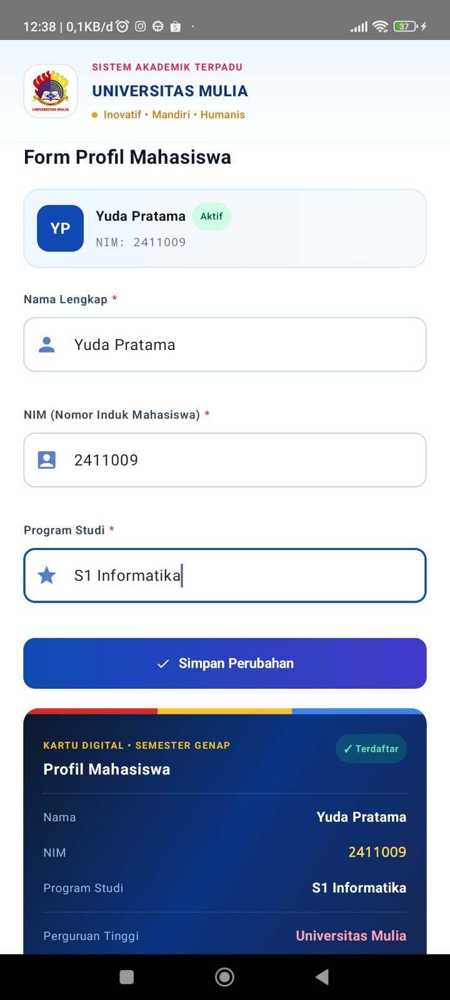

# Form Profil Mahasiswa

Aplikasi Android sederhana dengan Jetpack Compose untuk mata kuliah
Pemrograman Aplikasi Bergerak.

## Fitur
- Input Nama, NIM, dan Program Studi (TextField)
- Validasi input dan pesan error
- Tombol Simpan aktif hanya jika data valid
- Kartu profil dan Snackbar setelah data disimpan

## Konsep
State, Event, Recomposition, State Hoisting

## Cara Menjalankan
1. Clone repository ini
2. Buka di Android Studio
3. Jalankan di emulator atau perangkat

## Screenshot

### Sebelum Input
Form masih kosong, tombol Simpan nonaktif, dan kartu profil belum berisi data.

 

### Sesudah Input
Setelah semua field diisi dan tombol Simpan ditekan, kartu profil dan ringkasan mahasiswa terisi otomatis dari state.

## Identitas
Nama: Yuda Pratama
NIM: 2411009
Kelas: IFB5J
Mata Kuliah: Pemrograman Aplikasi Bergerak